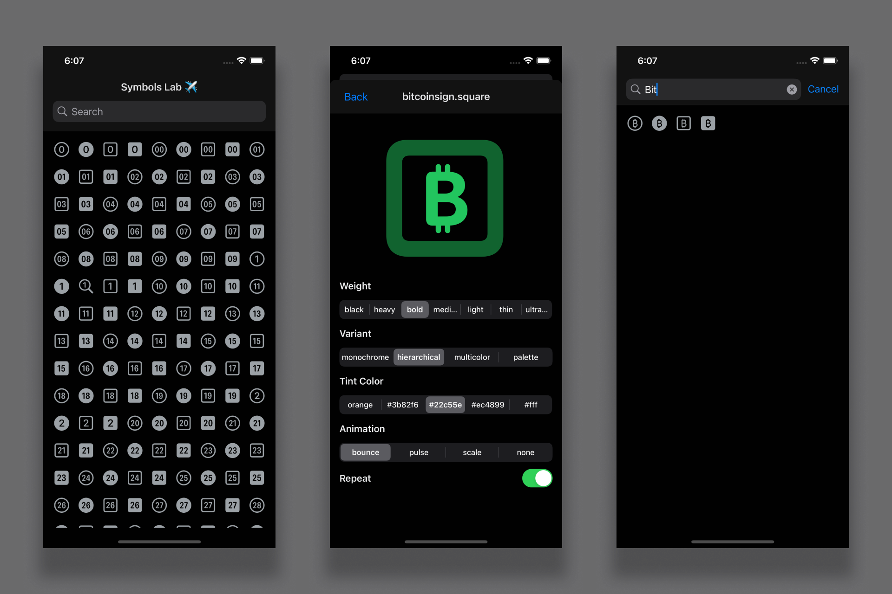

<h1 align="center">Mobile Symbols Control (React Native - Expo)</h1>

<p align="center">
  

  

  
  
  <a href="https://github.com/williamjayjay/Github-Blog/commits/master">
    
  </a>
    
   <a href="https://github.com/williamjayjay/symbols-app-mcode/stargazers">
    
  </a>
</p>

<p align="center">
This application focuses on listing and customizing Expo-Symbols with interactive style controls using the `@react-native-segmented-control/segmented-control` library. The app features seamless navigation and an intuitive interface for experimenting with symbol styles such as colors, animations, and other visual properties.
</p>

<p align="center">

</p>

## VideoCase
<!-- video here -->

## 🥶 About the Project

I developed this project to enhance my knowledge of React Native, navigation, and dynamic UI styling. The goal is to provide a practical and visually engaging way to explore and customize the Expo-Symbols library.

## Mobile React Native:

**Application:** The app allows users to navigate through symbol options, adjust their styles interactively, and visualize changes in real time, leveraging segmented controls for a better user experience.

## 🚀 Technologies

Key technologies used in this application:

- [Expo-Symbols](https://docs.expo.dev/versions/latest/sdk/symbols/)
- [Segmented Control](https://docs.expo.dev/versions/latest/sdk/segmented-control/)

## Getting Started

To install and configure a local copy, follow these steps:

### Prerequisites

Ensure the following steps are completed to run the app:

1.**Clone the repository**:
```sh
git clone https://github.com/williamjayjay/symbols-app-mcode
```

2.**Navigate to the root of the project symbols app mcode**

3.**Install the dependencies**:
  ```sh
  bun i
  ```

4.**Run the application**:
  ```sh
  bun android
  ```
   or
  ```sh
  bun ios
  ```
